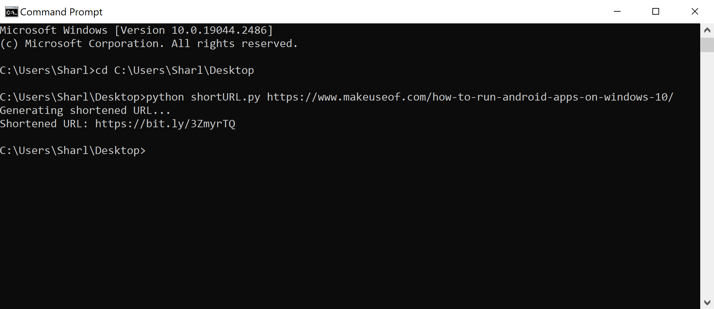

# python-bitly-link-shortener
This is a Python script that uses the Bitly API to shorten a long link.
When you run the script, enter the long URL you want to shorten as a command line argument.

## To Run

* Navigate to the python-bitly-link-shortener folder in the command line or terminal.
* Run the script using the python command, and enter the URL: `python shortURL.py https://www.makeuseof.com/tag/3-ways-run-android-apps-windows/`

## Example

